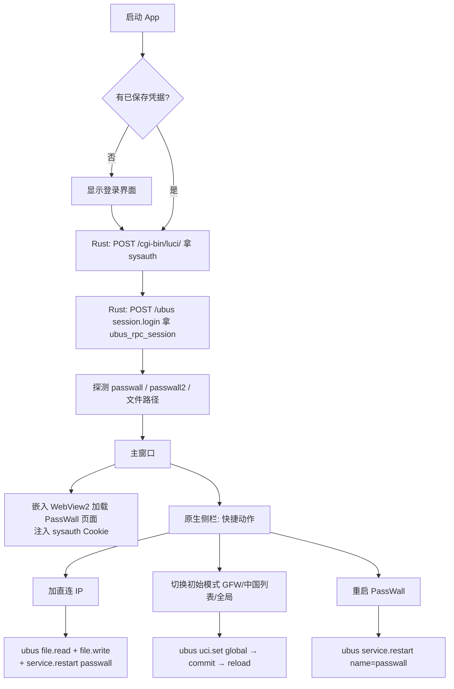

# KWRT / OpenWrt PassWall 快速控制器 —— Windows 端可行性调研

> 目标：用 **Tauri 2 + Rust** 实现一个 Windows 桌面客户端，能够：
> 1. 记住路由器地址 / 账号 / 密码，启动后自动登录；
> 2. 直接跳到 PassWall 配置界面（等价于 `http://10.0.0.1/cgi-bin/luci/admin/services/passwall`）；
> 3. 提供"快捷动作"——尤其是把某些 IP / 域名加入 **直连列表**（不走代理），并即时生效。
>
> 后续阶段：Android 端用原生 Kotlin / Jetpack Compose 复用同样的网络协议层（本文档先聚焦 Windows）。

---

## 1. 关键结论（TL;DR）

| 维度 | 结论 |
|---|---|
| **是否绑定 KWRT** | **不绑定**。PassWall 是标准 OpenWrt 上的 LuCI 应用 (`luci-app-passwall`)，KWRT 只是把它默认打包进固件，协议层和 OpenWrt/ImmortalWrt 等其它发行版一致。 |
| **登录认证** | 现代 LuCI（19.07+）使用 **`sysauth` Cookie**；登录方式两选一：①表单 POST `/cgi-bin/luci/`；②`ubus` 的 `session.login`。两种都能从 Rust 端直接调用。 |
| **配置读写** | 优先走 **ubus over HTTP**（`POST /ubus`）调用 `uci` 命名空间；或安装 `luci-mod-rpc` 走老的 JSON-RPC（`/cgi-bin/luci/rpc/uci`）。两条路都能改 `/etc/config/passwall`。([JSON-RPC 文档](https://github.com/openwrt/luci/wiki/JsonRpcHowTo)) |
| **PassWall 配置载体** | UCI 文件 `/etc/config/passwall`，含 `global`、`acl_rule`、`nodes`、`subscribe_list` 等 section。直连/代理/屏蔽/GFW 四张列表也都映射到 UCI option，**可程序化读写**。 |
| **生效方式** | `uci commit passwall` + `/etc/init.d/passwall restart`（或 reload），两者都能通过 ubus 的 `service`/`uci`/`file` 调用触发。 |
| **Tauri 2 适配度** | 高。Rust 侧用 `reqwest` + cookie store 调 LuCI/ubus，凭据用 Windows DPAPI（`keyring` crate）或 `tauri-plugin-stronghold` 加密保存；前端做面板 UI。无任何浏览器 CORS 限制（HTTP 走 Rust 端发起）。 |
| **风险** | ①不同 PassWall 版本（passwall vs **passwall2**）section/option 名略有差异；②自签 HTTPS 证书需在 reqwest 显式放行；③KWRT 默认主题/补丁可能改动登录表单字段名，需要兼容多套模板；④账号默认 `root`，密码明文保存到 Windows 上需要妥善加密。 |

**整体可行性：高。** 建议分两阶段实现，第一阶段先以 **WebView2 嵌入 + 自动登录注入 Cookie** 验证打通链路，第二阶段再补"原生快速面板"。

---

## 2. KWRT 与 PassWall 的关系

- **KWRT**（仓库 [`kiddin9/Kwrt`](https://github.com/kiddin9/Kwrt)）是基于 OpenWrt/ImmortalWrt 的定制固件集合，**默认集成了 `luci-app-passwall`**。
- 截图里的 `首页/状态/系统/服务 → PassWall` 菜单结构是 LuCI 标准结构，URL `cgi-bin/luci/admin/services/passwall` 也是 luci-app-passwall 自己注册的路径，**与 KWRT 无强耦合**。
- 因此本客户端理论上能直接连任何安装了 luci-app-passwall 的 OpenWrt 设备（ImmortalWrt、LEDE、KWRT、Lean's 源等都通用）。
- 唯一需要小心的"分支差异"是 **PassWall vs PassWall 2**（`luci-app-passwall2`，UCI 文件名 `passwall2`，部分 option 重命名）。客户端应在登录后**探测**实际存在的 UCI 文件名。

---

## 3. LuCI 认证与远程调用机制

OpenWrt LuCI 提供三套可被远程调用的接口，三者都能用：

### 3.1 方式 A：表单登录 + 抓 `sysauth` Cookie（最通用）
- `POST http://<router>/cgi-bin/luci/`
- Body（`application/x-www-form-urlencoded`）：`luci_username=root&luci_password=<pwd>`
- 成功后响应 Set-Cookie：`sysauth=<hex>`（部分版本叫 `sysauth_http` 或 `sysauth_https`）。
- 之后所有请求带上该 Cookie，访问 `/cgi-bin/luci/admin/services/passwall` 等页面即可——**WebView2 嵌入方案就是用这个**。

### 3.2 方式 B：ubus over HTTP（推荐用于程序化操作）
默认在 `/ubus` 暴露（前提 `uhttpd` 启用 `ubus_prefix`，OpenWrt 默认开启）。先登录拿 session id：

```http
POST /ubus
Content-Type: application/json

{
  "jsonrpc": "2.0", "id": 1, "method": "call",
  "params": [
    "00000000000000000000000000000000",
    "session", "login",
    { "username": "root", "password": "<pwd>" }
  ]
}
```
响应里 `result[1].ubus_rpc_session` 就是后续调用要带的 token。然后任何调用都形如：

```json
{"jsonrpc":"2.0","id":2,"method":"call",
 "params":["<session>","uci","get",{"config":"passwall"}]}
```

可用对象（ACL 允许下）：`uci`、`file`、`service`、`network`、`system` 等，足够覆盖**读取配置、写入配置、commit、重启服务**全流程。

### 3.3 方式 C：老式 JSON-RPC（需额外安装包）
- 文档：[`openwrt/luci` Wiki — JsonRpcHowTo](https://github.com/openwrt/luci/wiki/JsonRpcHowTo)
- 依赖：`opkg install luci-mod-rpc luci-lib-ipkg luci-compat` 并重启 uhttpd。
- 端点：`/cgi-bin/luci/rpc/auth`、`/cgi-bin/luci/rpc/uci?auth=<token>`、`/cgi-bin/luci/rpc/sys?auth=<token>`。
- 优点：调用语义更直观，`uci.get_all("passwall")` 一把梭。
- 缺点：**默认不安装**；KWRT 是否带要看构建配置。可作为"高级"开关，主路径走方式 B。

> 实现建议：**优先方式 B（ubus）作为程序化通道**，方式 A 用于"打开内嵌 WebView 时种 Cookie"。方式 C 仅在用户主动允许且检测到已安装时启用。

---

## 4. PassWall 配置数据模型（直连 / 代理 / 屏蔽 / GFW）

`/etc/config/passwall` 是 UCI 格式。常见 section 与选项（以社区主流版本为参考，**具体 key 以登录后 `uci get_all passwall` 实际返回为准**）：

| Section | 作用 | 与截图的对应关系 |
|---|---|---|
| `config global 'global'` | 全局开关、TCP/UDP 默认代理、初始模式 | "基本设置 → 模式"页签里的「TCP/UDP 默认代理模式」「初始模式」「客户端代理」等开关 |
| `config global_haproxy` / `global_delay` / `global_forwarding` 等 | 性能与转发细节 | 高级设置 |
| `config nodes` | 单个节点 | 节点列表 |
| `config subscribe_list` | 订阅源 | 节点订阅 |
| `config acl_rule` | 设备级访问控制 | 访问控制 |
| 列表文件（直连/代理/屏蔽/GFW） | 多以 **文件** 存在于 `/usr/share/passwall/rules/`（如 `direct_host`、`direct_ip`、`proxy_host`、`proxy_ip`、`block_host`、`block_ip`、`gfwlist`），并通过 `passwall` 的 option 开关启用 | 截图里 4 个「使用 XX 列表」开关 |

### 4.1 "把某 IP 加入直连列表" 的最小操作链

这是你最关心的快捷动作。两条等价路径：

**路径 1（修改规则文件，最直接）：**
1. `ubus call file read '{"path":"/usr/share/passwall/rules/direct_ip"}'` → 取现有列表
2. 追加用户输入的 IP/CIDR
3. `ubus call file write '{"path":"/usr/share/passwall/rules/direct_ip","data":"<新内容>"}'`
4. `ubus call service event '{"type":"config.change","data":{"package":"passwall"}}'` 或直接：
5. `ubus call service restart '{"name":"passwall"}'`（也可用 `init` / `luci.rpc` 接口）

**路径 2（修改 UCI option，再 commit + reload）：**
1. `uci.set("passwall", "<section>", "<option>", value)`
2. `uci.commit("passwall")`
3. 重启服务同上。

> 推荐路径 1 用于"直连/代理/屏蔽/GFW 四张明文列表"；路径 2 用于"开关、节点、ACL"等结构化字段。

### 4.2 兼容性自检策略
登录后客户端先做一次"探测"：
- `uci.get(config="passwall")` 是否成功 → 判定为 PassWall 1；否则尝试 `passwall2` → PassWall 2。
- `file.stat` 检查 `/usr/share/passwall/rules/` 下文件是否存在 → 决定快捷动作的具体写入路径。
- 缓存版本信息，后续按版本走不同代码分支。

---

## 5. Windows 端技术选型

### 5.1 框架：Tauri 2
- **WebView2** 作 UI 渲染层，Rust 侧承担网络与凭据。包体积小（< 10MB），原生体验佳。
- 前端框架建议 **Vue 3 + Element Plus** 或 **React + Ant Design**（与截图风格接近，可快速拼出 PassWall 风格的设置面板）。
- Tauri 2 的多窗口、托盘、自动更新、Sidecar 等能力均满足。

### 5.2 关键 Rust 依赖
| crate | 用途 |
|---|---|
| `reqwest`（开启 `cookies`、`rustls-tls`、`json`） | HTTP 调用 LuCI / ubus，自动管理 sysauth cookie |
| `serde` / `serde_json` | ubus JSON-RPC 报文与配置模型 |
| `keyring` 或 `tauri-plugin-stronghold` | 凭据加密保存（前者用 Windows DPAPI / Credential Manager） |
| `tokio` | 异步运行时（Tauri 2 默认带） |
| `rustls` + `webpki-roots`（或开 `danger_accept_invalid_certs`） | 兼容自签 HTTPS 路由器 |
| `tauri-plugin-store` | 保存路由器地址、上次选择的快捷动作等非敏感配置 |

### 5.3 凭据保存方案
- **不要**明文写入 JSON 文件。
- 推荐：`keyring` crate → 写入 Windows Credential Manager（按"目标 = `kwrt-controller://<host>`"区分多台路由器）。
- 用户首次登录时勾选"记住密码"才落盘；提供"清除已保存凭据"按钮。
- 敏感字段日志脱敏。

### 5.4 三种 UI 形态对比

| 形态 | 描述 | 工作量 | 用户体验 |
|---|---|---|---|
| **A. 纯 WebView 透传** | 登录后把 sysauth Cookie 注入 WebView2，直接加载 `…/admin/services/passwall` | 最低 | 等同浏览器，价值有限（但能验证链路） |
| **B. 原生面板 + 后台调用** | 完全自绘 UI，所有操作通过 ubus 调用 | 最高 | 最佳，可做"快捷动作"卡片、托盘菜单一键直连 |
| **C. 混合**（推荐） | 默认嵌 WebView 给"完整设置"，**另外**提供原生侧边栏专做高频操作（加直连 IP、切换初始模式、重启 PassWall、查看运行状态） | 中等 | 高频操作高效，低频操作复用官方 UI |

---

## 6. 端到端流程（形态 C）



---

## 7. PoC 验证清单（建议两天内完成）

1. **网络可达性 PoC**（Rust 命令行小程序，无 UI）：
   - 输入 host / user / pass，跑通 ubus session.login。
   - `uci.get_all passwall` 拉到完整配置打印出来。
   - 在 `direct_ip` 末尾追加一条测试 IP，重启 passwall 服务，登录路由器 SSH 验证文件已变更。
2. **WebView2 自动登录 PoC**：
   - Tauri 启动空白窗口 → Rust 拿到 sysauth → 用 `WebviewWindow::eval` 注入 `document.cookie = "sysauth=..."` → 加载 `…/admin/services/passwall`，验证免登录直达。
3. **凭据保存 PoC**：
   - `keyring` 写入/读取 Windows 凭据管理器，重启 App 后免输入。
4. **兼容性快速验证**：
   - 同时测 PassWall 1 + PassWall 2 + 自签 HTTPS 路由器（如开了 https-only 的实例）。

任一项失败再回头改方案；目前没有看到 blocker。

---

## 8. 已识别的风险与缓解

| 风险 | 影响 | 缓解 |
|---|---|---|
| KWRT 自带主题或登录页改了表单字段名 | 方式 A 登录失败 | 检测 200 但无 sysauth 时降级到方式 B（ubus session.login） |
| ubus ACL 限制 root 之外的用户 | 非 root 账号调不通 uci/file | 文档里说明"建议 root"，或引导用户给账号加 `/usr/share/rpcd/acl.d/` 规则 |
| PassWall 升级导致 option 改名 | 直连写入失败 | 写入前先 `uci.get` 探测；规则文件路径用 `file.stat` 确认 |
| 自签 HTTPS | reqwest 默认拒绝 | UI 提供"信任此证书指纹"开关，开后用 `danger_accept_invalid_certs` 并显示指纹 |
| 公网暴露 LuCI 风险 | 凭据泄露 | App 内提示"建议仅在 LAN/VPN 内使用"，并支持配置 WireGuard/Tailscale 前置 |
| 凭据明文持久化 | 安全 | 强制走 `keyring`/DPAPI，禁止落到 JSON |

---

## 9. 里程碑

| 里程碑 | 内容 | 验收 |
|---|---|---|
| M1 | Rust CLI PoC：登录 + 读 passwall 配置 + 改直连 IP + 重启 | SSH 看到 `/usr/share/passwall/rules/direct_ip` 已更新，PassWall 仍正常运行 |
| M2 | Tauri 壳子 + 凭据保存 + WebView2 自动登录 | 双击 exe → 自动进入 PassWall 设置页 |
| M3 | 原生快捷面板（加直连 IP / 模式切换 / 服务重启 / 状态指示） | 在面板里 3 秒内完成"把某 IP 加入直连"全流程 |
| M4 | PassWall vs PassWall2 兼容、自签证书、多路由器配置 | 切换两台不同型号路由器无需重新输密码 |
| M5（Android） | 复用同协议层，用 Kotlin + OkHttp 重写网络层；UI Jetpack Compose | 与 Windows 端共用 ubus 协议契约 |

---

## 10. 结论

- 协议层**完全可行**且**与 KWRT 解耦**，复用到任何带 luci-app-passwall 的 OpenWrt 设备。
- Tauri 2 + Rust 是非常合适的技术栈：HTTP 调用在 Rust 侧规避了 WebView 的 CORS；凭据可走 Windows DPAPI 安全保存；WebView2 又能"零成本"复用 PassWall 官方 UI 作为兜底。
- 建议**先做 M1（Rust CLI PoC）**——这是整个项目的技术风险出口，跑通后 M2~M4 都是工程量问题。
